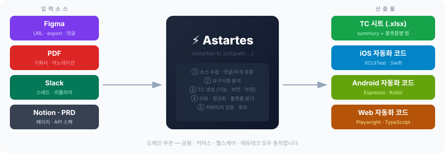
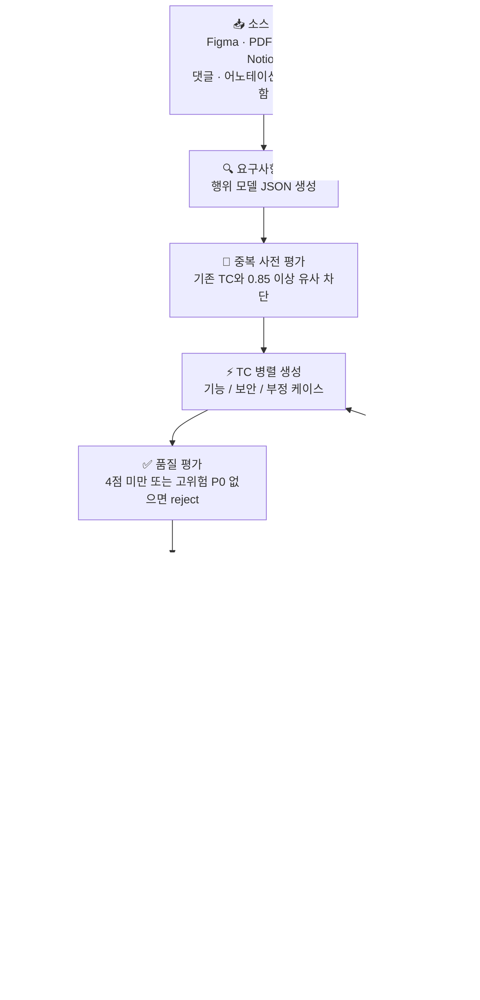
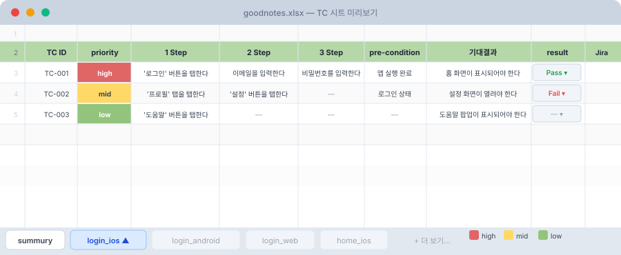

# Astartes


> 명세서를 넣으면 TC 시트와 자동화 코드가 나옵니다



Figma·PDF·Slack·Notion 명세서를 입력하면 iOS·Android·Web 3개 플랫폼의 **TC 시트(.xlsx)** 와 **자동화 코드**를 자동으로 만들어 줍니다.  
Claude Code 슬래시 명령어 한 줄로 실행됩니다. 도메인 무관 — 금융·커머스·헬스케어·에듀테크 모두 동작합니다.

---

## 시작하기 (5분)

### 1단계 — 저장소 받기

```bash
git clone https://github.com/SmallTyrant/Astartes.git
cd Astartes
```

Claude Code에서 이 폴더를 엽니다. 에이전트와 명령어가 자동으로 인식됩니다.

### 2단계 — 의존성 설치

Claude Code 채팅창에 입력:

```
/astartes-doctor
```

Python·openpyxl·Node·Playwright 등 필요한 의존성을 자동으로 점검하고 설치합니다. 이미 설치된 항목은 건너뜁니다.

| 옵션 | 설명 |
|---|---|
| `/astartes-doctor` | 처음 한 번 — 미설치 항목만 설치 |
| `/astartes-doctor --force` | 전체 재설치 |
| `/astartes-doctor --browsers` | Playwright 브라우저까지 설치 (~300MB) |
| `/astartes-doctor --check` | 설치 상태만 확인 (변경 없음) |

### 3단계 — TC 생성

URL이나 파일 경로를 그대로 붙여넣으면 됩니다. 소스 타입은 자동 감지됩니다.

```
/astartes-tc https://figma.com/file/ABC...
```

```
/astartes-tc https://figma.com/file/ABC... ./inputs/pdf/spec.pdf ios,web
```

```
/astartes-tc   ← 인자 없이 실행하면 inputs/ 폴더를 스캔
```

완료되면 `outputs/sheets/{앱이름}.xlsx` 파일과 Google Drive 링크가 출력됩니다.

> **토큰이 필요한 경우** (URL로 직접 연동 시):
> ```bash
> export FIGMA_TOKEN=...   # Figma URL 사용 시
> export NOTION_TOKEN=...  # Notion URL 사용 시
> export SLACK_TOKEN=...   # Slack URL 사용 시
> ```
> 토큰 없이도 `inputs/` 폴더에 파일을 직접 넣어 사용할 수 있습니다.

---

## 명령어 요약

| 명령어 | 설명 |
|---|---|
| `/astartes-doctor` | 의존성 점검 · 설치 · 자동 수복 |
| `/astartes-tc [url/path ...] [플랫폼]` | 소스 자동 감지 → TC 생성 → XLSX export → Drive 업로드 |
| `/astartes-tc --export-only` | TC 재생성 없이 XLSX export + Drive 업로드만 |

**플랫폼 지정 예시**: `ios`, `android`, `web`, `ios,web`, `ios,android,web` (기본값)

**소스 자동 감지 규칙**:

| 입력 | 감지 타입 |
|---|---|
| `figma.com` 포함 URL | Figma |
| `slack.com` 포함 URL | Slack |
| `notion.so` 포함 URL | Notion |
| `.pdf` 확장자 | PDF |
| 인자 없음 | `inputs/` 폴더 스캔 |
| `fixture-mode` | 토큰·파일 없이 픽스처로 즉시 테스트 |

---

## 어떻게 동작하나요?



---

## 산출물



TC 시트는 **앱당 1개의 XLSX 파일**로 생성됩니다. `summury` 시트 + 화면·플랫폼별 탭으로 구성됩니다.

```
outputs/
├── sheets/
│   └── {appname}.xlsx          # 단일 워크북 (summury + 탭들)
├── testcases/
│   └── {screen}_{platform}.json
├── ios/                         # XCUITest Swift 코드
├── android/                     # Espresso Kotlin 코드
├── web/                         # Playwright TypeScript 코드
└── traceability.csv             # 요구사항 ↔ TC 추적성
```

### 시트 규칙 (변경 불가)

| 항목 | 규칙 |
|---|---|
| 파일 수 | 앱당 1개. 화면별 분리 금지 |
| 레이아웃 | Row 1 비움 / Row 2 헤더(연두 #B6D7A8) / Row 3+ 데이터 |
| priority 색 | `high` 빨강 · `mid` 노랑 · `low` 초록 |
| result | 드롭다운 (Pass/Fail/Block/N/A). **기본값은 빈 칸** — QA가 실행 후 채움 |
| summury 수식 | `=COUNTA`, `=COUNTIF` 명시적 행 번호 사용. open-ended 범위 금지 |

---

## 명세가 바뀌었을 때

명세서가 변경되어 TC를 다시 생성하면, 기존 수행 결과(result)를 **자동으로 보존**합니다.

| 케이스 | result |
|---|---|
| TC 내용이 바뀌지 않은 경우 | 기존 Pass / Fail / Block / N/A 그대로 유지 |
| steps · expected 등 내용이 바뀐 경우 | 빈 칸으로 초기화 (재수행 필요) |
| 새로 추가된 TC | 빈 칸 |
| 삭제된 TC | 행 유지 + result를 `N/A`로 설정 (명세 변경·제거 이력 보존) |

> 내용 변경 판정: `steps`, `expected`, `precondition`, `priority`, `risk_tags`, `title` 중 하나라도 다르면 초기화.  
> 해시 사이드카: `outputs/sheets/{appname}_snapshot.json`에 자동 저장.

---

## 로컬 파일로 사용하기

토큰 없이 파일을 직접 넣어 사용할 수 있습니다.

| 소스 | 넣는 위치 |
|---|---|
| Figma export JSON | `inputs/figma/export/` |
| PDF 기획서 | `inputs/pdf/` |
| Notion export | `inputs/notion/export/` |
| PRD · API 스펙 | `inputs/prd/` 또는 `inputs/api-spec/` |

파일을 넣은 뒤 `/astartes-tc` (인자 없이) 실행.

---

## 자주 묻는 질문

**Q. Figma 댓글에 상세 명세가 있는데 반영되나요?**  
A. 네. Figma 댓글, Slack 스레드 리플라이, PDF 어노테이션을 본문과 동등하게 분석해 TC를 생성합니다.

**Q. TC를 수동으로 수정했는데 덮어써지나요?**  
A. `result` 컬럼은 보존됩니다. TC 내용(steps 등)을 직접 수정한 경우 재생성 시 초기화됩니다. JSON 파일을 직접 수정하는 방식을 권장합니다.

**Q. 특정 플랫폼만 생성할 수 있나요?**  
A. 네. `/astartes-tc https://figma.com/... ios,web` 처럼 마지막에 플랫폼을 지정하세요.

**Q. Google Drive 업로드를 건너뛰고 싶어요.**  
A. Drive MCP가 설정되지 않으면 자동으로 건너뜁니다. 로컬 파일(`outputs/sheets/`)은 항상 생성됩니다.

---

## 트러블슈팅

| 증상 | 조치 |
|---|---|
| `FIGMA_TOKEN not set` | `export FIGMA_TOKEN=...` 후 재시도. 해당 소스만 건너뛰고 다른 소스는 계속 진행됩니다 |
| MCP 서버 미등록 | `scripts/fetch_*.py` 폴백으로 자동 처리. 별도 조치 불필요 |
| `/astartes-doctor` 재실행해도 변화 없음 | sentinel 파일 존재. `--force` 옵션으로 강제 재설치 |
| `#NAME?` 오류가 시트에 표시됨 | summury 수식에 open-ended 범위 사용됨. `--export-only`로 재생성 |
| Web TC 코드가 `getByText` 사용했다고 reject | `data-testid` 매칭만 허용. 디자인 시안에 testid 부여 필요 |
| coverage-gaps.json이 계속 비지 않음 | iter 3 도달 시 `needs_review: true`로 종료. 해당 source_ref를 직접 검토 후 `inputs/`에 보강 |

---

## 다른 프로젝트에서 XLSX 스킬만 사용하기

TC JSON이 있는 프로젝트에서 시트 생성 기능만 가져다 쓸 수 있습니다.

```bash
# 스킬 디렉토리 복사
cp -r .claude/skills/astartes-tc /path/to/other-project/.claude/skills/

# 의존성
pip install openpyxl

# 실행
python3 .claude/skills/astartes-tc/scripts/export_workbook.py <appname>
```

전역(`~/.claude/skills/`)에 두면 모든 프로젝트에서 호출 가능합니다.

---

## 참고 문서

| 문서 | 내용 |
|---|---|
| [`CLAUDE.md`](./CLAUDE.md) | Claude Code용 프로젝트 지침 |
| [`.claude/skills/astartes-tc/references/tc-schema-v3.md`](./.claude/skills/astartes-tc/references/tc-schema-v3.md) | TC JSON v3 스키마 전체 사양 |
| [`.claude/skills/astartes-tc/references/sheet-layout.md`](./.claude/skills/astartes-tc/references/sheet-layout.md) | 셀 좌표 · 색상 · 수식 패턴 |
| [`.claude/skills/astartes-tc/references/step-decomposition.md`](./.claude/skills/astartes-tc/references/step-decomposition.md) | Step 분해 사례 · 어휘 |
| [`inputs/README.md`](./inputs/README.md) | 입력 경로 상세 |
